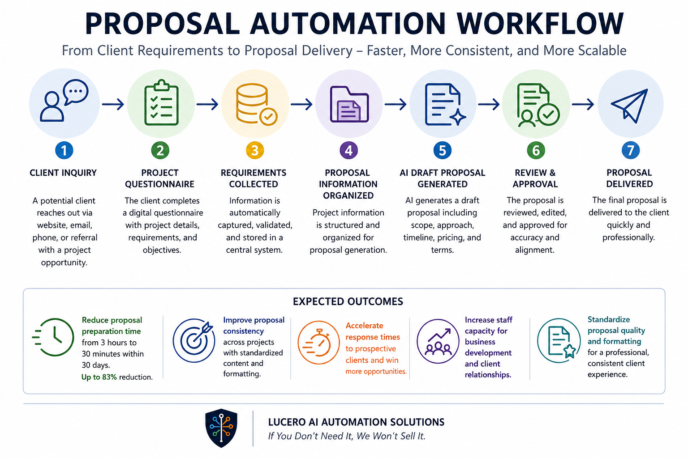

# Proposal Automation Workflow

## Outcome

Reduce proposal preparation time from 3 hours to 30 minutes within 30 days while improving consistency, response times, and proposal quality.

---

## Overview

This project demonstrates how organizations can automate proposal preparation by transforming project requirements into structured proposal drafts, reducing repetitive document creation and administrative effort.

The workflow is designed to help businesses respond faster to opportunities while maintaining consistent proposal quality.

---

## Business Challenge

Many organizations spend significant time:

- Gathering project requirements
- Reusing information from previous proposals
- Formatting documents
- Creating scopes of work
- Preparing pricing summaries
- Drafting proposal narratives

These manual activities increase preparation time and delay responses to prospective clients.

---

## Solution

The Proposal Automation Workflow streamlines proposal preparation by collecting project information, generating draft content, and standardizing proposal creation.

### Workflow

Client Inquiry

↓

Project Questionnaire

↓

Requirements Collected

↓

Proposal Information Organized

↓

AI Draft Proposal Generated

↓

Review & Approval

↓

Proposal Delivered

---

## Expected Outcomes

### Faster Proposal Development

Reduce proposal preparation time from 3 hours to 30 minutes within 30 days.

### Improved Consistency

Standardize proposal language and formatting across projects.

### Faster Client Response

Accelerate response times to prospective clients and opportunities.

### Increased Staff Capacity

Allow employees to focus on business development and client relationships.

### Higher Proposal Quality

Improve proposal consistency, professionalism, and formatting standards.

---

## Technology Examples

This workflow could be implemented using technologies such as:

- Microsoft Forms
- Google Forms
- Airtable
- Microsoft Power Automate
- Zapier
- OpenAI
- Microsoft Word Templates

Technology selection depends on organizational requirements and existing systems.

---

## Business Impact

Organizations implementing proposal automation workflows can:

- Increase proposal turnaround speed
- Improve proposal consistency
- Reduce repetitive administrative work
- Improve client responsiveness
- Increase staff productivity
- Create a more scalable proposal process

---

## Who This Helps

- Professional Services Firms
- Consulting Firms
- Architecture Firms
- Engineering Firms
- Marketing Agencies
- Nonprofit Organizations
- Small Businesses

---

## Consulting Approach

Lucero AI Automation Solutions follows a trust-based approach:

> If You Don't Need It, We Won't Sell It.

The objective is to identify the simplest solution that delivers measurable business results without unnecessary software, subscriptions, or complexity.

---

## Project Status

Portfolio Demonstration Project

This project demonstrates a practical proposal automation workflow and is intended as an example of how proposal preparation processes can be redesigned to improve efficiency, consistency, and client responsiveness.
